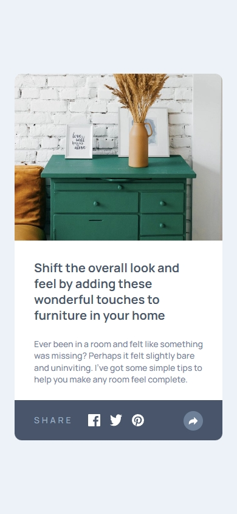
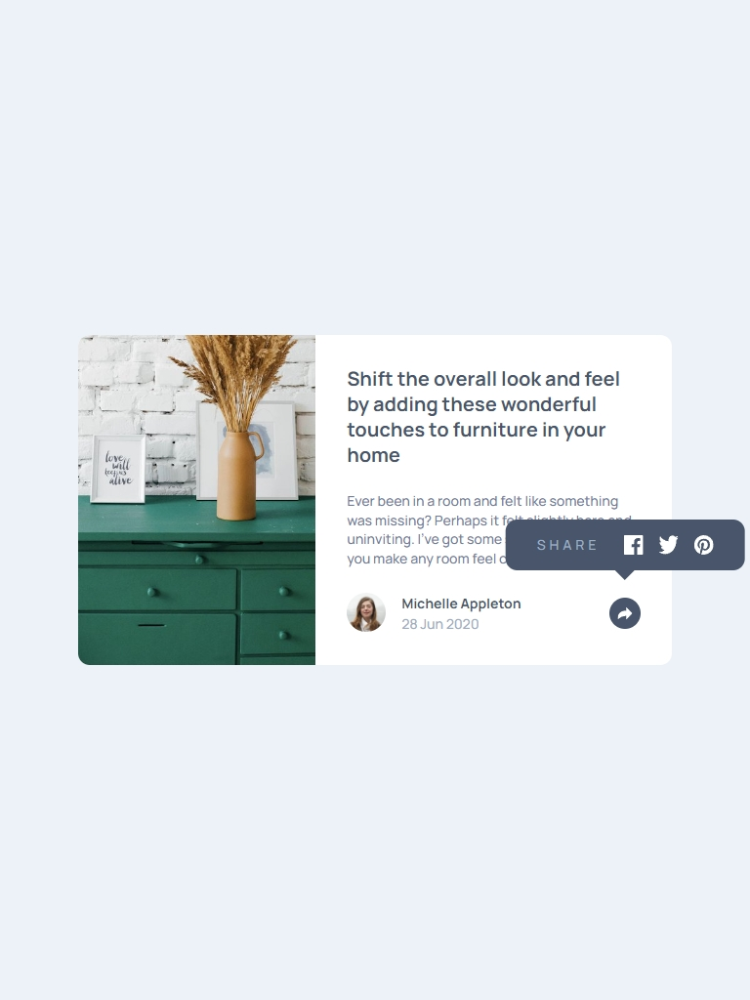
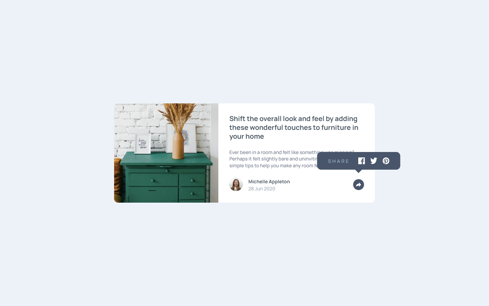

# Article Preview

A responsive article preview built with **React**, **Vite**, and **Tailwind CSS**.  
This project is a solution to the [Frontend Mentor Article Preview Component Challenge](https://www.frontendmentor.io/challenges/article-preview-component-dYBN_pYFT).

## LIVE SITE:

[](https://aflamiano-career.github.io/article-preview-component/)

---

## Table of contents

- [Overview](#overview)
  - [The Feature](#the-feature)
  - [Screenshots](#screenshots)
- [My process](#my-process)
  - [Built with](#built-with)
- [Acknowledgements](#acknowledgements)

---

## Overview

### The Feature

Users should be able to:

- See the social media share links when they click the share icon
- View the optimal layout for each page depending on their device's screen size
- See hover states for all interactive elements on the page

### Screenshots (Click to view larger)

  

---

## Built with

- Semantic HTML5 markup
- CSS custom properties
- Flexbox
- Mobile-first workflow
- [React](https://reactjs.org/) - Component-based JS library.
- [Tailwind CSS](https://tailwindcss.com/) - Utility-first CSS framework.
- [Vite](https://vitejs.dev/) - Fast and lean development build tool.
- JavaScript (ES6): Modern JavaScript features and best practices.

#### Sample code

```jsx
function ShareButton({ bgColor, arrowColor, onClick }) {
  return (
    <button
      className={`min-w-8 min-h-8 rounded-full relative cursor-pointer ${bgColor}`}
      onClick={onClick}
    >
      <svg
        xmlns="http://www.w3.org/2000/svg"
        width="15"
        height="13"
        className={`${arrowColor} absolute top-1/2 left-1/2 -translate-x-1/2 -translate-y-1/2`}
      >
        <path d="M15 6.495L8.766 .014V3.88H7.441C3.33 3.88 0 7.039 0 10.936v2.049l.589-.612C2.59 10.294 5.422 9.11 8.39 9.11h.375v3.867L15 6.495z" />
      </svg>
    </button>
  );
}

export default ShareButton;
```

---

## Acknowledgements

- [Frontend Mentor](https://www.frontendmentor.io/) for the challenge and design inspiration.

---
